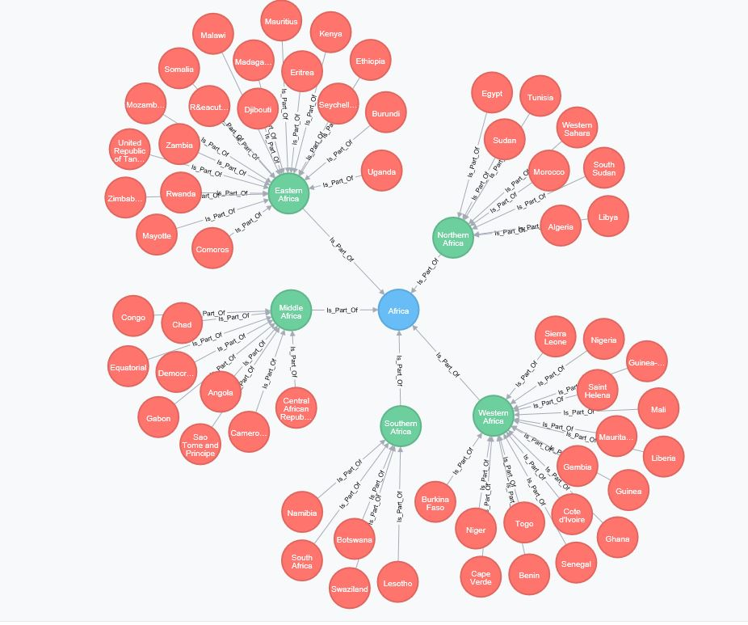
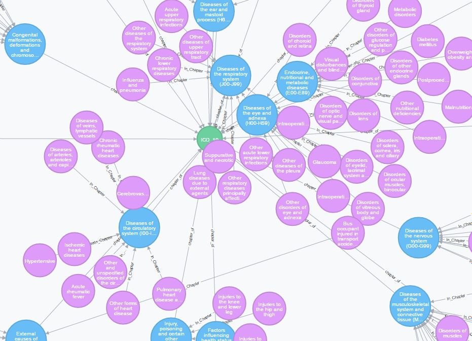

# Neo4j United Nations Structure

## ISO 3166 Country codes

Based on the United Nations country codification, the ISO created the Standard 3166.

These small set of cyphers create the basic United Nations Structure, organs and specialized agencies, country definitions, continent and continent regions.

Most of the organizations need to have basic "standarized" catalogs, to avoid data duplication and to be able to interchange data other organizations.

You need to have intalled the Neo4j database.

These rustic cypher commands creates a simple graph like this one.

